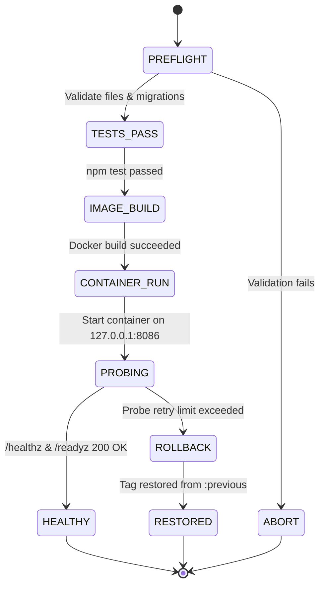

# FSM Runtime Spec: G-APPR-007

## Deployment State Transitions

```mermaid
stateDiagram-v2
    [*] --> PREFLIGHT
    PREFLIGHT --> TESTS_PASS: Validate files & migrations
    PREFLIGHT --> ABORT: Validation fails
    TESTS_PASS --> IMAGE_BUILD: npm test passed
    IMAGE_BUILD --> CONTAINER_RUN: Docker build succeeded
    CONTAINER_RUN --> PROBING: Start container on 127.0.0.1:8086
    PROBING --> HEALTHY: /healthz & /readyz 200 OK
    PROBING --> ROLLBACK: Probe retry limit exceeded
    ROLLBACK --> RESTORED: Tag restored from :previous
    HEALTHY --> [*]
    RESTORED --> [*]
    ABORT --> [*]
```
